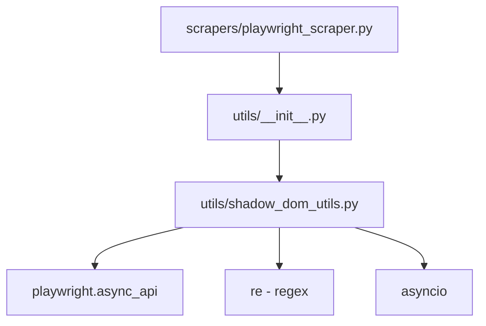

# Utils Module Structure

## Directory Layout

```
app/utils/
├── __init__.py              # Package exports (main entry point)
├── README.md                # Detailed documentation
├── STRUCTURE.md            # This file - quick reference
└── shadow_dom_utils.py     # Shadow DOM extraction utilities
```

## Quick Import Reference

### Main Functions (Public API)

```python
# Import from utils package (recommended)
from utils import wait_shadow_aware, extract_shadow_aware

# Or import directly from module
from utils.shadow_dom_utils import wait_shadow_aware, extract_shadow_aware
```

### Advanced Functions (Internal API)

```python
# For advanced use cases, import internal functions
from utils.shadow_dom_utils import (
    _query_all_shadow_chain_handles,
    _clean_xpath_and_mode,
)
```

## Function Overview

| Function | Purpose | Returns |
|----------|---------|---------|
| `wait_shadow_aware()` | Wait for element (shadow-aware) | None |
| `extract_shadow_aware()` | Extract text/attributes (shadow-aware) | `list[str]` |
| `_query_all_shadow_chain_handles()` | Get element handles from shadow DOM | `list[ElementHandle]` |
| `_clean_xpath_and_mode()` | Parse XPath for extraction mode | `tuple[str, str\|None, bool]` |

## Module Dependencies



## Usage Patterns

### Pattern 1: Basic Extraction
```python
from utils import extract_shadow_aware

values = await extract_shadow_aware(page, '//pt-element/text()')
```

### Pattern 2: Wait + Extract
```python
from utils import wait_shadow_aware, extract_shadow_aware

await wait_shadow_aware(page, '//pt-element', timeout_ms=30000)
values = await extract_shadow_aware(page, '//pt-element/text()')
```

### Pattern 3: Advanced (Element Handles)
```python
from utils.shadow_dom_utils import _query_all_shadow_chain_handles, _clean_xpath_and_mode

clean_xpath, attr, text_mode = _clean_xpath_and_mode('//pt-element/@href')
handles = await _query_all_shadow_chain_handles(page, clean_xpath)
# ... custom processing
```

## Adding New Utilities

1. **Create new module**: `app/utils/new_utils.py`
2. **Add exports**: Update `app/utils/__init__.py`
3. **Document**: Add to `app/utils/README.md`
4. **Update**: Add to this structure file

Example:
```python
# app/utils/__init__.py
from .shadow_dom_utils import wait_shadow_aware, extract_shadow_aware
from .new_utils import new_function  # Add new exports

__all__ = [
    "wait_shadow_aware",
    "extract_shadow_aware",
    "new_function",  # Add to __all__
]
```

## Testing

Test utilities independently:

```python
# tests/utils/test_shadow_dom_utils.py
import pytest
from utils.shadow_dom_utils import extract_shadow_aware

@pytest.mark.asyncio
async def test_extract_shadow_aware():
    # Test implementation
    pass
```

## Maintenance

- **Owner**: Scraping team
- **Last Updated**: October 16, 2025
- **Review Frequency**: Quarterly
- **Breaking Changes**: Requires version bump

## Related Files

- `app/scrapers/playwright_scraper.py` - Main consumer
- `examples/00_test_xpath.ipynb` - Working examples
- `REFACTORING_SUMMARY.md` - Refactoring documentation

